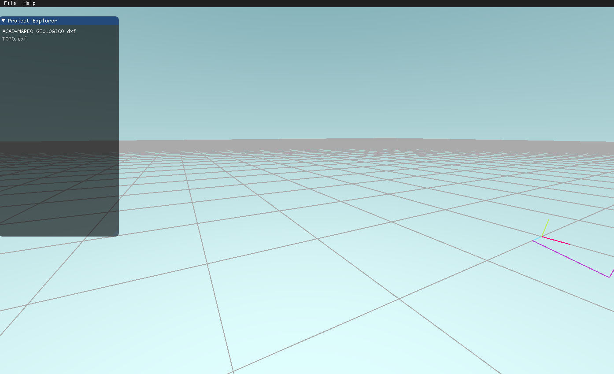

# MiningPlanningEngine

## A planning engine for mining engineering

### How to build

You need to have a [git][gitLink] version control system installed.

You need to have [Rust][RustLink] installed.

[RustLink]:https://www.rust-lang.org/tools/install
[gitLink]:https://git-scm.com
Then run the followings commands in a console (you will need to be given access to the repository)
```
git clone https://github.com/Yairama/MiningPlanningEngine.git
```
```
cd MinningPlanningEngine
```
For Windows OS:
```
cargo run --features vulkan
```
For MAC OS:
```
cargo run --features metal
```

For a release run (much faster):
```
cargo run --release --features metal/vulkan
```

If you have performed the steps correctly, the following window should open



use WASD keys for movement and mouse movement for camera view and pres ESC key to close.

### TO DO:

-Complete the GUI.

-Add functionality for analyzing DXF files
