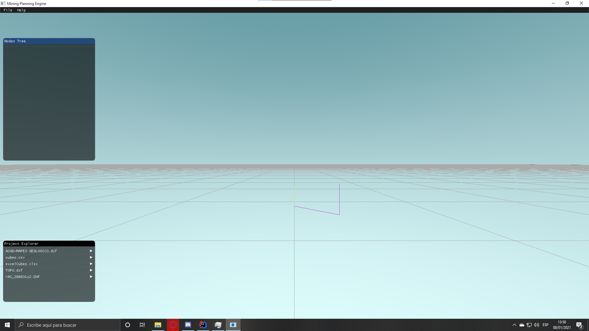
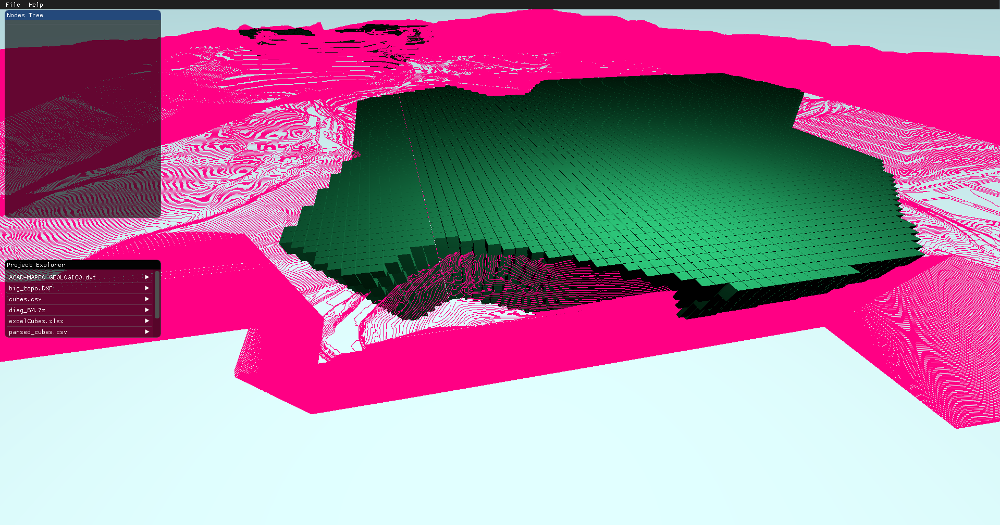

# MiningPlanningEngineALPHA
## NOTE: The repository will be archived to start with a beta dev.
## A planning engine for mining engineering

### How to build

You need to have a [git][gitLink] version control system installed.

You need to have [Rust][RustLink] installed.

[RustLink]:https://www.rust-lang.org/tools/install
[gitLink]:https://git-scm.com
First unzip the files into \MiningPlanningEngine\projects\ folder
Then run the followings commands in a console (you will need to be given access to the repository)
```
git clone https://github.com/Yairama/MiningPlanningEngine.git
```
```
cd MinningPlanningEngine
```
For Windows OS:
```
cargo run --features vulkan
```
For MAC OS:
#### NOTE: its necesary to change the library Cargo.tom file
```
amethyst-imgui = { version = "0.7.1", features = ["metal"] }
```

```
cargo run --features metal
```

For a release run (much faster):
```
cargo run --release --features metal/vulkan
```

If you have performed the steps correctly, the following window should open



use WASD keys for movement and mouse movement for camera view and pres ESC key to close.

### TO DO:

-Complete the GUI.

-Add Cubes maps generator

## Results
got to big_topo.DXF/ Draw DXF in the menu option, then go to parsed_cubes.csv/ Generate Cube Maps.
If you have performed the steps correctly, the following window should open:



See a detailed video in ```screenshots/Mining Planning Engine 2021-01-10 08-26-18.mp4```
